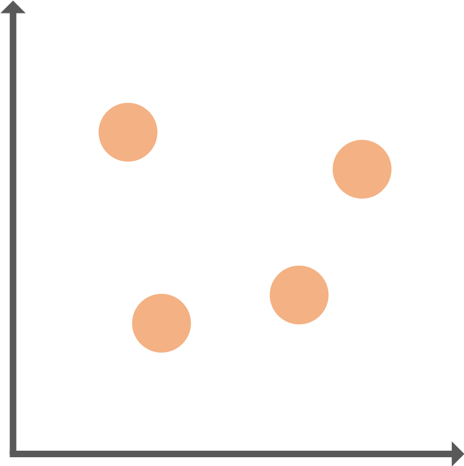
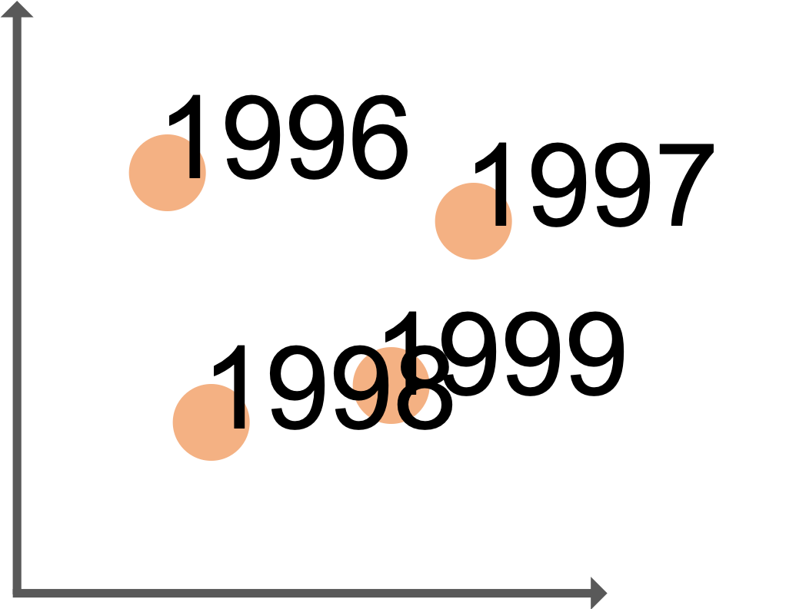
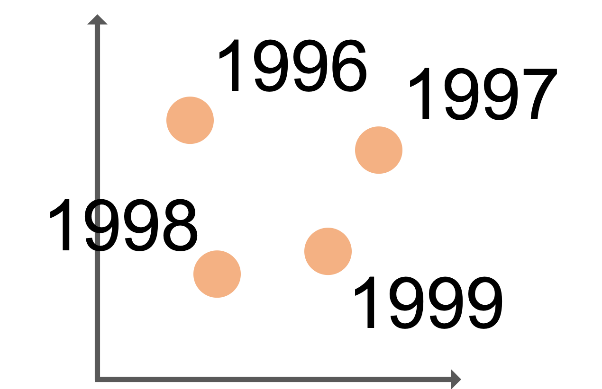
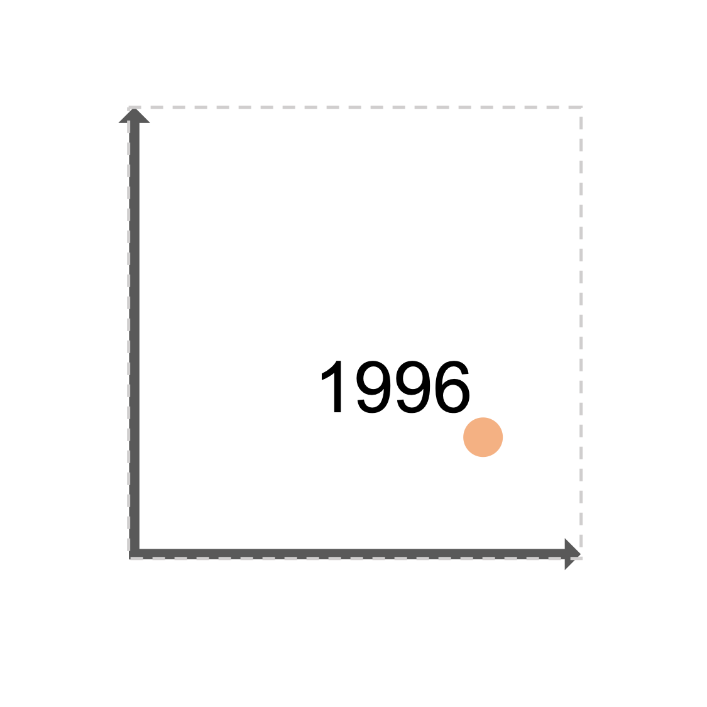
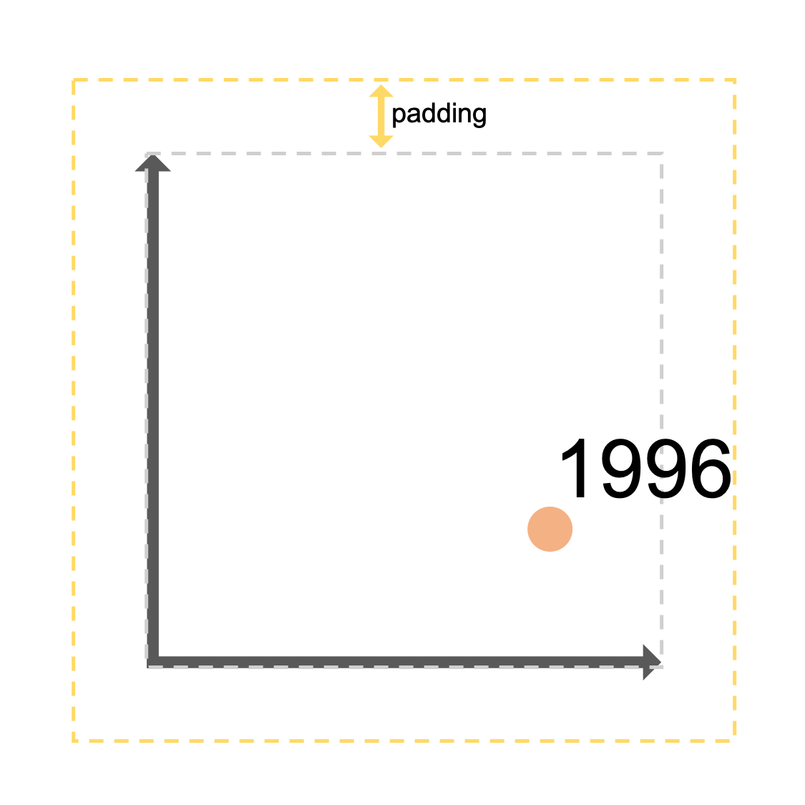
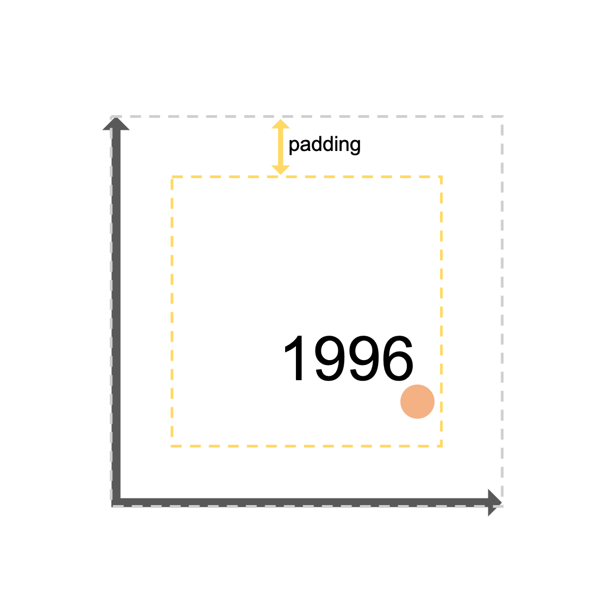
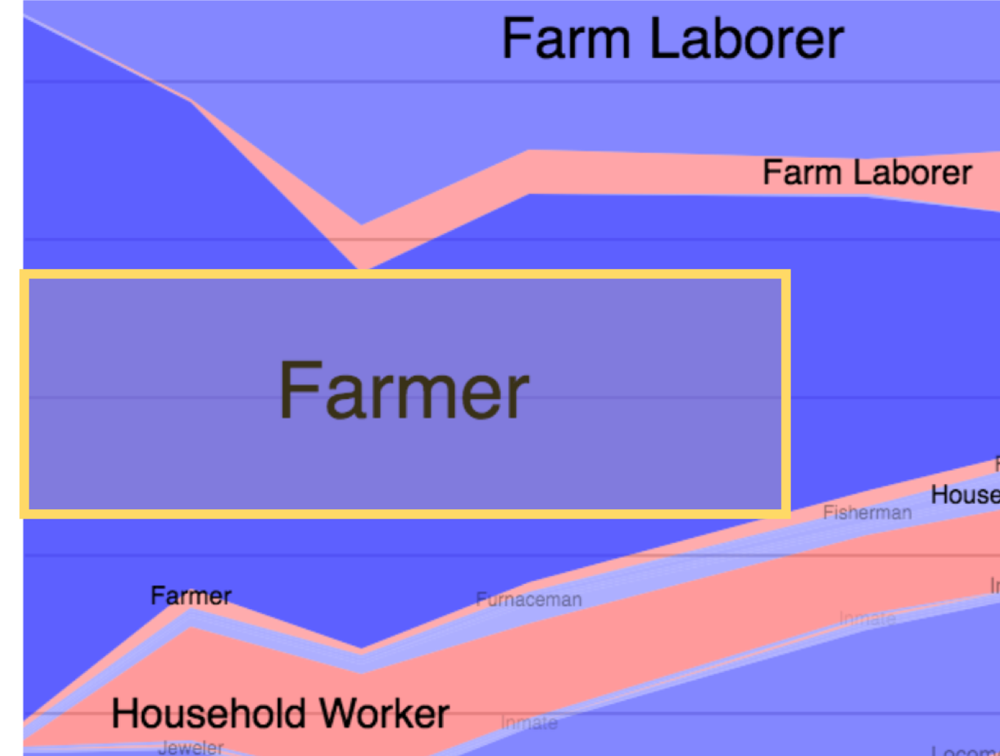
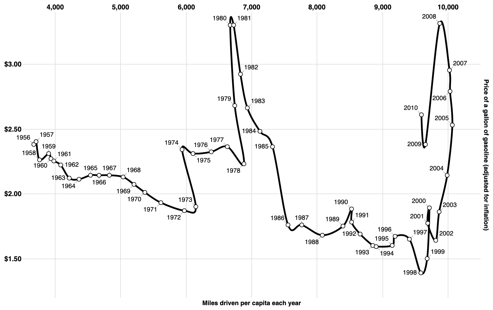
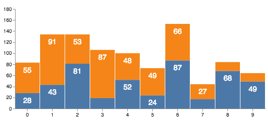
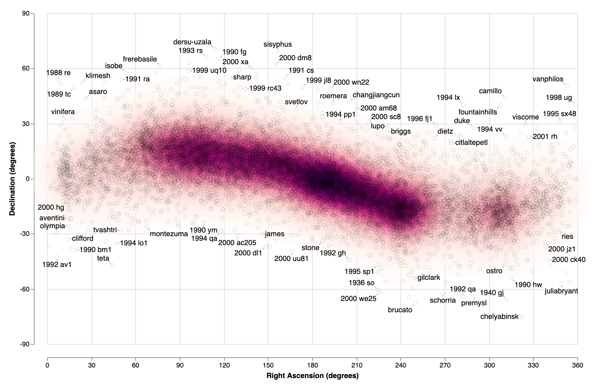

# Vega-Label

**Vega-Label is now in the Vega repo at https://github.com/vega/vega/tree/master/packages/vega-label**

The **label** transform repositions texts in text mark, so that their placements are not colliding with other elements in the chart. Those elements include marks that have name included in property `avoidMarks` and the mark that is used as backing data (as explained in [reactive geometry](https://vega.github.io/vega/docs/marks/)) of the text mark this label transform is transforming.

The label transform is useful for labeling data points by creating a text mark that takes in data from the mark that represents the data point (we will call this 'base mark' for this label documentation), then use the label transform on the text mark to reposition the text, so that the texts appear near their data points without colliding into other objects in the chart.

## Transform Parameters

| Property      |              Type               | Description                                                                                                                                                                                                                                                                                                                                                                                                                |
| :------------ | :-----------------------------: | :------------------------------------------------------------------------------------------------------------------------------------------------------------------------------------------------------------------------------------------------------------------------------------------------------------------------------------------------------------------------------------------------------------------------- |
| sort          |     | the field indicating order of labels to be placed (**greater** will be placed **after**).                                                                                                                                                                                                                                                                                                                                  |
| padding       |    | the amount of pixels label can extend pass chart bounding box. **Default value:** `0`                                                                                                                                                                                                                                                                                                                                      |
| size          |  |  size of the chart in format `[width, height]`. **This size have to match with the chart size**.                                                                                                                                                                                                                                                                                                     |
| anchor        |                                                                                                                                                                                                                                                                                                                                                                                                                   | list of anchor points of labels relative to its base mark's bounding box that you want Vega-Label to consider placing. The available options are `"top-left"`, `"left"`, `"bottom-left"`, `"top"`, `"bottom"`, `"top-right"`, `"right"`, `"bottom-right"`, `"middle"`. Can also be specified as a single anchor point. **Default value:** `["top-left", "left", "bottom-left", "top", "bottom", "top-right", "right", "bottom-right"]` |
| offset        |                                                                                                                                                                                                                                                                                                                                                                                                                   | list of offset of labels relative to its base mark's bounding box. This list is parallel to the list of anchor points. This property can also be specified as a single number for a constant offset through every anchor point. **Default value:** `[1, 1, 1, 1, 1, 1, 1, 1]` |
| avoidMarks    |  | The property `avoidMarks` is useful when you want to take other objects in the chart into consideration when placing label. For example, in connected scatter plot in below example, we do not want label to the data point itself, but we also do not want a line to cross over our labels. So, we have to add the name of the line mark into `avoidMarks` to avoid the line when placing labels. **Default value:** `[]` |
| avoidBaseMark |   | the flag to specify if you want you labels to collide with the base mark. This flag is usually `true` (no allowing collision between labels and base mark); however, in some case like area chart, we want to place each label inside its area, so this flag has to be `false`. **Default value:** `true`                                                                                                                  |
| lineAnchor    |    | When labeling group-line mark, you can only have one label per 1 line. `lineAnchor` specify if you want the labels to be at the beginning (`"begin"`) or at the end (`"end"`) of the line. **Note**: this property only works with group line mark as the base mark. **Default value:** `"end"`                                                                                                                            |
| markIndex     |    | `markIndex` is used to specify which mark in the group mark you want to label because group mark can have more than 1 mark in the group. Regularly, `markIndex` is used with group-line and group-area mark. **Note**: `markIndex` only works with group mark as the base mark. **Default value:** `0`                                                                                                                     |
| as            |  | The output fields written by the transform. The default is `['x', 'y', 'opacity', 'align', 'baseline', 'originalOpacity', 'transformed']`                                                                                                                                                                                                                                                                                  |

## Usage

### Basic concept

|            Symbol mark only            | Add text mark using reactive geometry | Add label transform to the text mark  |
| :------------------------------------: | :-----------------------------------: | :-----------------------------------: |
|  |   |  |

```
"marks": [
  {
    "type": "symbol",
    "name": "basePoint",
    "from": {"data": "drive"},
    "encode": {
      "enter": {
        "x": {"scale": "x", "field": "miles"},
        "y": {"scale": "y", "field": "gas"}
      }
    }
  },
  {
    "type": "text",
    "from": {"data": "basePoint"},
    "encode": {
      "enter": {
        "text": {"field": "datum.year"}
      }
    },
    "transform": [
      {"type": "label", "size": [800, 500]}
    ]
  }
]
```

In scatter plot, labeling can be done by having text mark that takes in data from the the symbol mark name `"basePoint"`(or what we call base mark). The text mark recieves all the information including position and bounding box of each point in `"basePoint"`. Then, we transform the text mark with label transform so that the labels spaced out nicely near the point it is representing and not colliding into each other.

**Note** the reason why we do not have `x` and `y` channels in the text mark's encoding is that label transform will replace the `x` and `y` channels of the text mark anyway. Label transform will use the position bounding box of each point in `"basePoint"` to decide the position of each label.

### How we label area chart

TODO: explain how Vega-Label works with area chart

### Further explanation of `padding`

|             padding = 0              |              padding > 0               |              padding < 0               |
| :----------------------------------: | :------------------------------------: | :------------------------------------: |
|  |  |  |

### `Anchor`/`Offset` confusion

`anchor` and `offset` are parallel array to specify possible positions of each label in relation to its data point bounding box. For example, when `anchor = ["top", "left", "right", "bottom"]` and `offset = [1, 2, 3, 4]`, the possible positions of each label in relation to its data point bounding box are top with offset=1, left with offset=2, right with offset=3, bottom with offset=4.

When the arrays of `anchor` and `offset` have different size, vega transform will auto pad the small array using the last element. For example, `anchor = ["top", "bottom", "left"]` and `offset = [1, 2, 3, 4, 5, 6]`, the padded `anchor` is `["top", "bottom", "left", "left", "left", "left"]`.

## Setting up Vega-Label Instructions

Right now, Vega-Label cannot be integrated into Vega yet.

However, for trying vega-label, first clone this repository

We assume you have [yarn](https://yarnpkg.com/en/) and [python](https://www.python.org/) installed (python is not necessary for running Vega, just for serving demo website).

1. Install the dependencies and build Vega-Label:

```
$ yarn && yarn build
```

2. Serve the demo site with python:

```
$ python -m SimpleHTTPServer
```

3. In browser, go to http://localhost:8000/demo.html to see demo for a Vega-Label example.

4. In demo.js, uncomment a spec name to try other examples, or try your own spec by putting them in directory `specs` with name format `label_SPECNAME.vg.json`.

## Examples of Vega-Label

### With area

#### In Stacked Area Chart - Job Voyager Example


Groups of area are used as the base mark, but `avoidBaseMark` flag is `false`, so labels can collide with their marks, but not to each other. Here is the [Vega Specification](./specs/label_area_job_voyager.vg.json).

|                                                                                                                                                                                                                                                                                                                                                        |                                                                                   |
| ------------------------------------------------------------------------------------------------------------------------------------------------------------------------------------------------------------------------------------------------------------------------------------------------------------------------------------------------------ | --------------------------------------------------------------------------------- |
| This example is from Vega [Job Voyager Example](https://vega.github.io/vega/examples/job-voyager/). In the original example, each label is placed at the position that has the widest vertical space in the area.                                                                                                                                      |      |
| When adding label using text with label transform, each label is placed at the position that has the largest rectangle (with the same ratil as the label) fitting in the area. This method is better because label transform considers both horizontal and vertical space, so it is more likely for the label to be placed completely inside the area. |  |

### With line

#### In Connected Scatter Plot - Connected Scatter Plot Example



Symbol is used as the base mark to label, and line is the mark to avoid when labeling. Here is the [Vega Specification](./specs/label_line_connected_scatter.vg.json).

This example is from Vega [Connected Scatter Plot Example](https://vega.github.io/vega/examples/connected-scatter-plot/). In the original example, the position of each label is pre-calculated into the dataset. Therefore, both the dataset and the vega spec depend on each other.

By adding label using text with label transform, the position of each label is calculated based on the object in the chart, so making changes to dataset or vega spec is more flexible.

#### In Grouped Lines Chart - Carbon Dioxide in the Atmosphere


Groups of line are used as the base mark to label, so one label is placed at the end of each line. Here is the [Vega Specification](./specs/label_line_end.vg.json).

This example is inspired by Vega-Lite [Carbon Dioxide in the Atmosphere](https://vega.github.io/vega-lite/examples/layer_line_co2_concentration.html). In the original, Vega-Lite example, we need to find the begining and the end data points of each line, and mark them as begin/end. Then, place labels twice. First time, place each label at the lower-right of its data point, and filter out all the labels except the beginning labels. Second time, do the same but place each label at the upper-right of its data point, and filter out all the labels except the end labels. This process is complicated, and may cause inefficiency by transforming and filtering out most of the labels.

By adding label using text with label transform in Vega, labels are automatically positioned at the end of each lines when the text mark's data is backed by the group-line mark using reactive geometry.

### With rect

#### In Stacked Bar Chart - Stacked Bar Chart Example



Rect is used as the base mark to label. There are 2 sets of labels in this chart. The first label is the overall height of each combined bars, and label positions is set to the outer top of each bar. The second label is the height of each bar, and label position is set to the inner top of each bar Here is the [Vega Specification](./specs/label_rect_stack.vg.json).

This example is inspired by Vega [Stacked Bar Chart Example](https://vega.github.io/vega/examples/stacked-bar-chart/). The original example does not have label on the chart.

When adding label using text with label transform, labels are placed in the available position, and they are hidden when there is not enough space (collision with the bar itself). The example is at the blue bars at `x = 3, 7` and the orange bars at `x = 8, 9`.

#### In Bar Bhart - Bar Chart Example


Rect is used as the base mark to label. The label position is set to inner right of each bar as default, and outer right if bar is too small. Here is the [Vega Specification](./specs/label_rect.vg.json).

### With symbol

#### In Scatter Plot - Asteroid Positions



Symbol is used as the base mark to label. Here is the [Vega Specification](./specs/label_scatter_asteroids.vg.json).

The data is from The Data Intensive Research in Astrophysics and Cosmology at the University of Washington.
