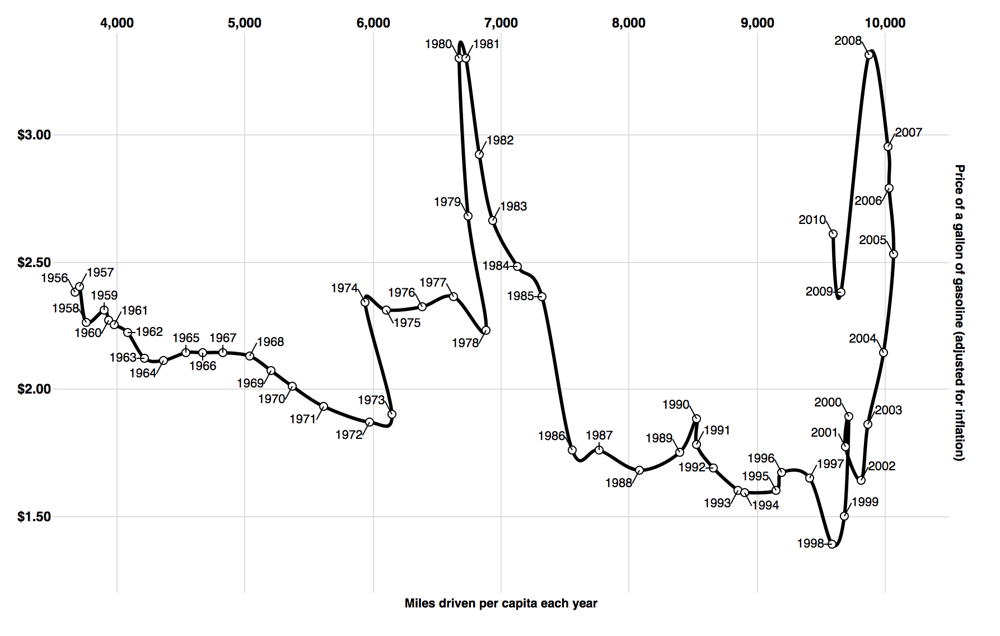

# vega-label

Labeling algorithm for Vega.

This module provides the following Vega post encoding transform:

- **Label**

## Syntax for label transform

```
"transform": [
  {
    "type": "label",
    "size": [ 800, 500 ],
    "offsets": [ 1, 2, -1 ],
    "sort": { "field": "datum.year" },
    "anchors": [ "top", "right" ]
    "marks": [ "basePoint", "baseLine" ]
  }
]
```

- `size`: size of the chart in format `[width, height]`

- `sort`: order of label to be placed (**greater** will be placed **after**)

- `anchors`: list of anchor points of labels to its mark's bounding box
  - From the example above, for each label, vega-label will try to place it at the `top` first, relative to its mark.
  - If it collide with some other mark or label, vega-label will try to place it at the `right`, relative to its mark.

- `offsets`: list of offset values from the bounding box of the **base mark**.
  - From the example above, vega-label will try to place label with offset value 1 first.
  - If it cannot place the label, vega-label will try to place label with offset value 2.
  - If it cannot place the label, vega-label will try to place label with offset value 1 inside its mark.
    - **Note**: label will be placed inside its mark if offset is negative.

- `marks`: list of data of mark; labels will not collide with these marks
  - Right now, vega-label works with `symbol`, `line`, and `rect`.

- label transform has to be used with reactive geometry to use it as base mark to calculate positions of label


## This is an example of vega-label in connected scatter plot



Here is the [Vega Specification](./spec/label_connected_scatter.vg.json)

